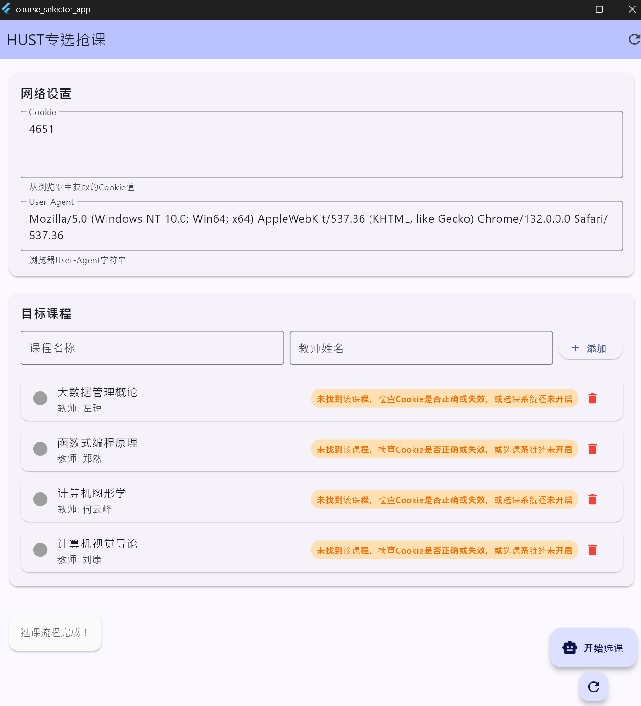
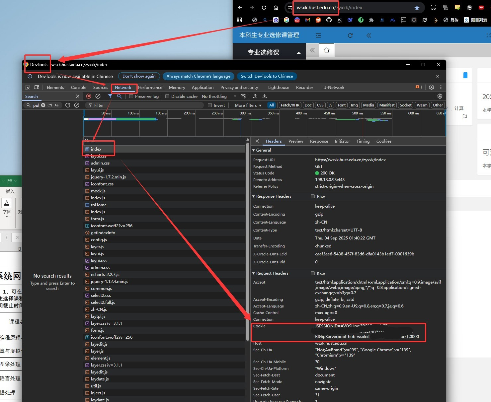

# HUST专选抢课 - Flutter GUI应用

**python脚本ver**：[HUST_Major_Course_Select](https://github.com/potatoshred/HUST_Major_Course_Select)



## Cookie查找说明：



## 功能特性

### 基础版本 (main.dart)

- ✅ Cookie输入框（带默认值提示）
- ✅ User-Agent输入框（带默认值）
- ✅ 可增删的选课列表
- ✅ 课程名和教师名分开输入
- ✅ 一键开始选课功能
- ✅ 实时状态显示
- ✅ 进度指示器

### 高级版本 (advanced_main.dart)

- ✅ 智能选课流程
- ✅ 可选课程预览
- ✅ 详细的选课状态跟踪
- ✅ 每门课程的单独状态显示
- ✅ 进度百分比显示
- ✅ 错误处理和重试机制

## 使用方法

### 1. 启动应用

```bash
cd course_selector_app
flutter pub get
flutter run -d windows  # Windows桌面版
flutter run -d chrome   # Web版
```

### 2. 配置网络设置

- **Cookie**: 从浏览器开发者工具中复制Cookie值
- **User-Agent**: 通常使用默认值即可，也可根据需要进行修改

### 3. 添加目标课程

- 在"课程名称"输入框中输入想选的课程名
- 在"教师姓名"输入框中输入对应的教师名
- 点击"添加"按钮将课程加入选课列表

### 4. 开始选课

- 点击"开始选课"或"智能选课"按钮
- 应用会自动查找匹配的课程和教师
- 实时显示选课进度和结果

## 界面说明

### 主界面组件

1. **网络设置卡片** - 配置Cookie和User-Agent
2. **选课列表卡片** - 管理和显示要选的课程
3. **状态显示卡片** - 显示当前操作状态
4. **浮动按钮** - 快速开始选课

### 状态指示

- 🟢 绿色勾选 - 选课成功
- 🟠 橙色提示 - 处理中或警告
- 🔴 红色错误 - 选课失败
- ⚪ 灰色圆圈 - 待处理

## 技术实现

### 网络请求

基于原Python脚本的API调用逻辑：

- `getXsFaFZkc` - 获取可选课程列表
- `getFzkt` - 获取课程具体班级信息
- `addStuxkIsxphx` - 提交选课请求

### 数据结构

```dart
class Course {
  String name;    // 课程名称
  String teacher; // 教师姓名
  bool isSelected; // 选课状态
  String status;   // 详细状态信息
}
```

## 注意事项

1. **Cookie有效性**: Cookie可能会过期，需要定期更新
2. **网络环境**: 确保在校园网环境下使用
3. **并发限制**: 避免过频繁的请求，建议间隔1-2秒
4. **课程冲突**: 系统会自动检测时间冲突的课程

## 故障排除

### 常见问题

- **"Cookie无效"**: 重新从浏览器获取最新的Cookie
- **"网络错误"**: 检查网络连接和校园网环境
- **"课程未找到"**: 确认课程名称和教师姓名拼写正确
- **"选课失败"**: 可能是课程已满或时间冲突

### 调试模式

在开发模式下，可以打开Flutter DevTools查看详细的网络请求日志：

```bash
flutter run -d windows --debug
```

## 扩展功能

未来可添加的功能：

- [ ] 课程时间表冲突检测
- [ ] 选课结果导出
- [ ] 自动重试机制
- [ ] 多账号支持
- [ ] 课程评分和评价
- [ ] 选课策略配置

## 项目结构

```
course_selector_app/
├── lib/
│   ├── main.dart                    # 基础版本
│   └── course_selection_service.dart # 网络服务层
├── pubspec.yaml
└── README.md
```

## 许可证

基于原Python脚本开发，保留原作者权益。
